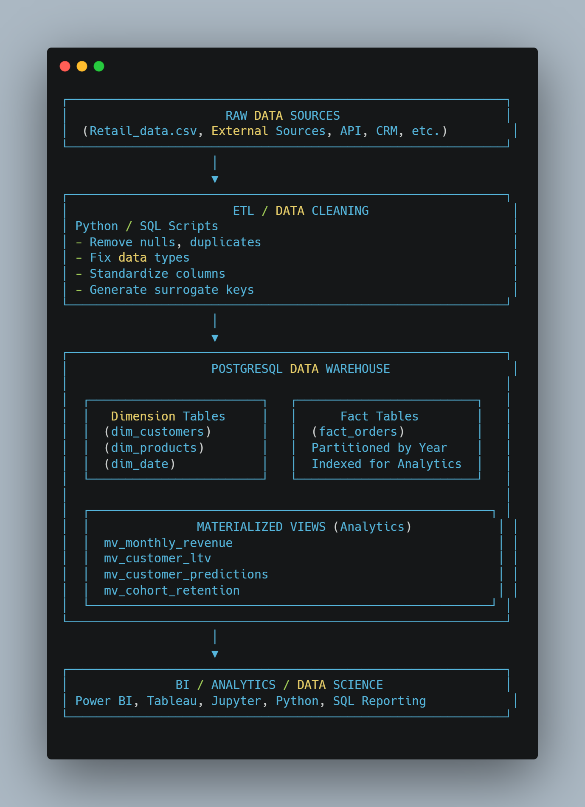

# 🏗️ Project Architecture — SQL Data Warehouse

This diagram shows the **end-to-end flow** of the e-commerce analytics system.

---

## 🖼️ Architecture Diagram

---

## 📌 Architecture Components

### **1. Raw Data (CSV)**
- Original customer, product, and transaction data.
- Stored outside version control for security.

### **2. ETL Layer (SQL Scripts)**
- Data cleaning
- Type casting
- Calculating metrics (e.g., `total_amount`)
- Surrogate key generation

### **3. Data Warehouse (PostgreSQL)**
Contains:
- Fact table: `fact_orders`
- Dimensions: `dim_date`, `dim_products`, `dim_customers`
- Materialized views for fast analytics

### **4. Analytics Layer**
Optimized SQL:
- Cohorts  
- RFM
- Customer LTV
- Churn scoring
- Monthly revenue

### **5. BI Tools (Optional)**
Power BI / Tableau (not included in repo anymore)

---

## 🚀 Why This Architecture?

- Modular SQL files make debugging easy  
- Warehouse schema ensures performance  
- Materialized views accelerate slow calculations  
- Works for large datasets (1M+ rows)

---

The architecture provides a scalable foundation for future dashboards or machine learning extensions.
