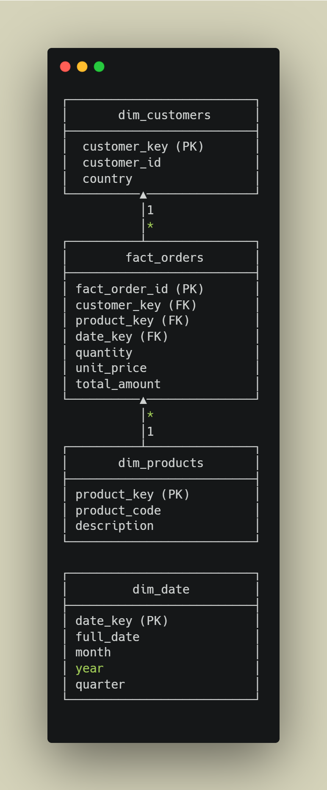

# 📊 Dimensional Data Model

This document describes the **logical model** behind the fact/dimension tables.

---

## 🖼️ Data Model Diagram  



---

## 📌 Model Principles

### **1. Surrogate Keys**
All dimension tables use integer surrogate keys:
- Auto-incremented
- Stable over time
- Faster joins

### **2. Slowly Changing Dimensions**
Current model uses **Type-1 updates** (overwrite).  
Can be extended to SCD-2 in the future.

### **3. Date Dimension**
Includes:
- full_date
- month
- year
- quarter

Used heavily for:
- trend analysis  
- seasonality  
- grouping & filtering

---

## 🎯 Query Example: Aggregation by Month

```sql
SELECT 
    d.year,
    d.month,
    SUM(f.total_amount) AS monthly_revenue
FROM fact_orders f
JOIN dim_date d ON f.date_key = d.date_key
GROUP BY d.year, d.month
ORDER BY d.year, d.month;
```

---

## 🧱 Benefits

- Clean separation of transactional vs descriptive data  
- Consistent grain: **1 row per order line**  
- Flexible for adding:
  - promotions  
  - suppliers  
  - shipping data  
  - returns fact table  

---

This data model forms the logical core of the warehouse and ensures smooth reporting and analytics.
