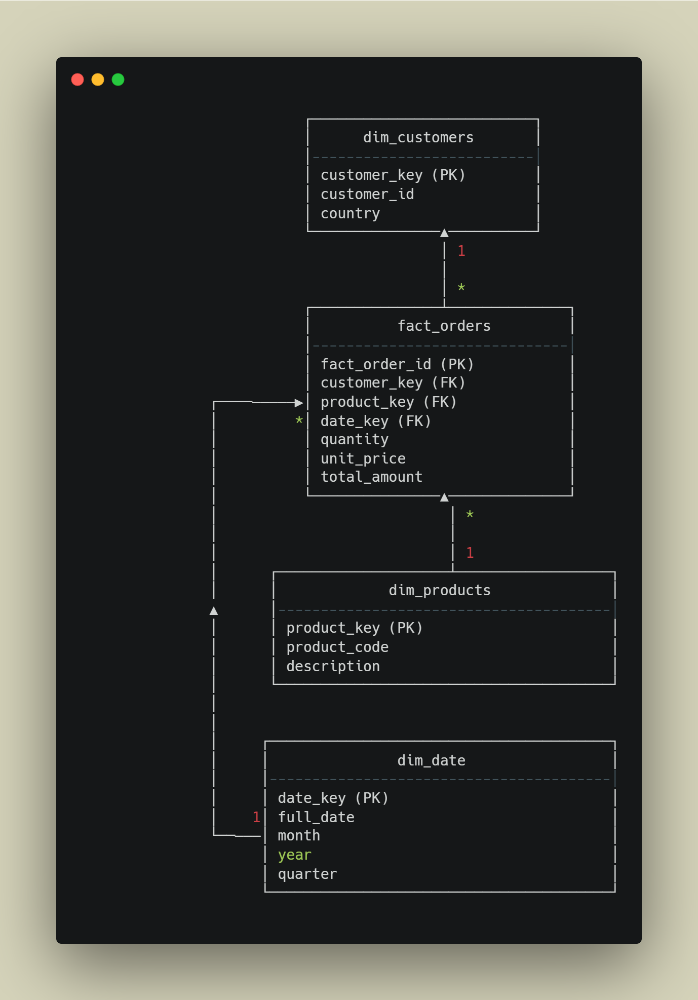

# 🧩 Entity-Relationship Diagram (ERD)

This ERD represents the **logical relationships** between all dimension tables and the fact table.

---

## 🖼️ ERD Diagram  




---

## 🔗 Relationship Summary

### **fact_orders**
- **customer_key → dim_customers.customer_key**  
  (One customer → many orders)

- **product_key → dim_products.product_key**  
  (One product → many orders)

- **date_key → dim_date.date_key**  
  (One date → many orders)

All relationships follow the typical **1-to-many (1:*)** pattern.

---

## 📝 Notes

- Fact table stores **foreign keys** only — no descriptive info.
- Dimensions contain **textual/contextual attributes** used for grouping.
- Surrogate keys (integers) ensure warehouse performance.

---

## 🎯 Example Query: Join All Tables

```sql
SELECT 
    c.country,
    p.description,
    d.full_date,
    SUM(f.total_amount) AS revenue
FROM fact_orders f
JOIN dim_customers c ON f.customer_key = c.customer_key
JOIN dim_products p ON f.product_key = p.product_key
JOIN dim_date d ON f.date_key = d.date_key
GROUP BY c.country, p.description, d.full_date;
```

---

The ERD gives a clean visual understanding of the analytic model powering the data warehouse.
