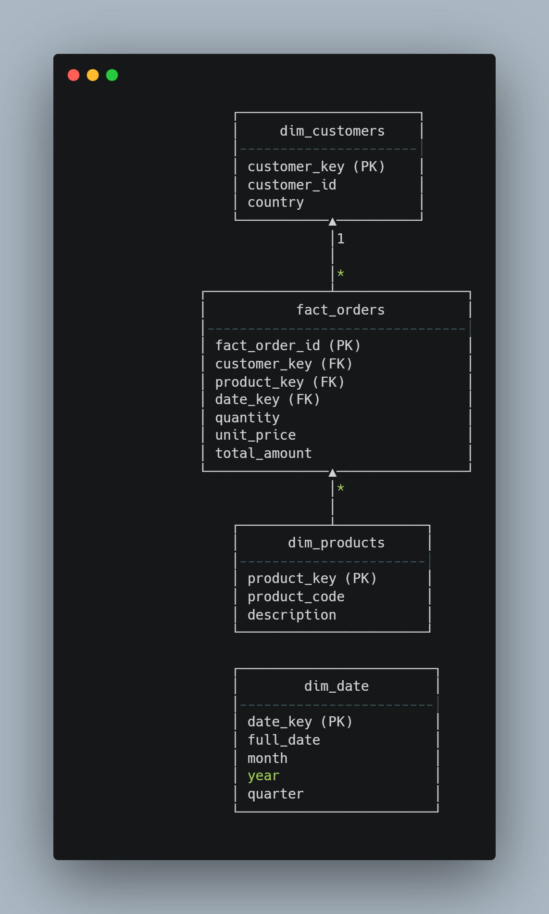

# ⭐ Star Schema — E-commerce Data Warehouse

This project uses a **classic Kimball-style star schema** optimized for analytics, reporting, and high-performance aggregations.

---

## 📌 Star Schema Overview

The data model consists of:

### **Fact Table**
- `fact_orders` — captures all transactional order data.

### **Dimension Tables**
- `dim_customers`
- `dim_products`
- `dim_date`

These dimensions provide descriptive attributes for slicing and aggregating the fact table.

---

## 🖼️ Star Schema Diagram





---

## 🔍 Table Descriptions

### **fact_orders**
| Column | Description |
|--------|-------------|
| fact_order_id | Surrogate primary key |
| customer_key | Customer reference |
| product_key | Product reference |
| date_key | Date reference |
| quantity | Units purchased |
| unit_price | Price per item |
| total_amount | quantity × unit_price |

---

### **dim_customers**
| Column | Description |
|--------|-------------|
| customer_key | PK |
| customer_id | Business key |
| country | Customer country |

---

### **dim_products**
| Column | Description |
|--------|-------------|
| product_key | PK |
| product_code | SKU |
| description | Product description |

---

### **dim_date**
| Column | Description |
|--------|-------------|
| date_key | PK (yyyymmdd integer) |
| full_date | DD-MM-YYYY |
| month | Month number |
| year | Year |
| quarter | Q1–Q4 |

---

## 🎯 Why Star Schema?

- Supports **fast aggregates** (SUM, COUNT, AVG)
- Enables **BI tools** (Power BI / Tableau) to run efficiently
- Clean separation of facts and dimensions
- Easy to extend with new dimensions or facts

---

## ✨ Useful Join Example

```sql
SELECT 
    d.full_date,
    p.description,
    SUM(f.total_amount) AS revenue
FROM fact_orders f
JOIN dim_date d ON f.date_key = d.date_key
JOIN dim_products p ON f.product_key = p.product_key
GROUP BY d.full_date, p.description
ORDER BY d.full_date;
```

---

This model forms the foundation of the entire analytics pipeline in the project.
